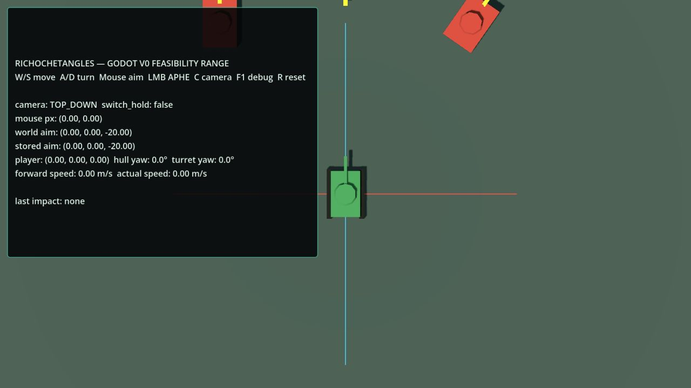
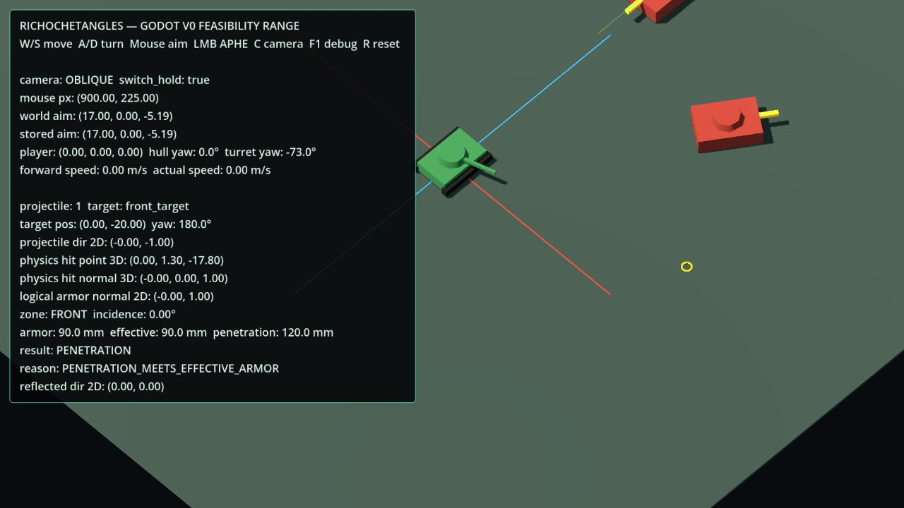

# RicochetAngles Godot V0.1

현재 활성 범위는 `Phase V0.1 — Moving Target Combat Spike`다. 기존 V0 사용자 검증은 `PASS`이며, V0.1은 그 위에 움직이는 표적 딱 1대와 최소 격파 수명주기만 추가한다.

- 이동 표적: 월드 X축의 결정론적 2점 왕복, `3.0 m/s`, 구간 길이 `10 m`
- 내구도: `HP 3`; 기존 APHE의 `PENETRATION`만 1 피해
- `NON_PENETRATION`과 `RICOCHET`: 피해 없음
- HP 0: `DESTROYED`, 이동·추가 피해 중지, collider 비활성화, 어두운 기울임 표시
- R: HP/상태/시작 위치·yaw/이동 방향·진행도/collider/시각/포탄/debug까지 초기화
- 기존 장갑 계산과 “마우스가 움직일 때만 새 조준점을 계산”하는 카메라 조준 정책은 변경하지 않음

이 프로젝트는 전체 포팅이 아니라 `Phase V0 — Godot Core Feasibility Spike` 전용 테스트장이다.

검증 대상은 다음뿐이다.

- `CharacterBody3D` 차체의 W/S 전후진과 A/D 선회
- 차체와 독립된 포탑 yaw
- 직교 카메라 ray와 XZ 지면의 마우스 조준 교차
- 탑다운/사선 직교 카메라와 C 전환
- APHE 1종의 프레임간 ray 충돌과 최초 충돌 처리
- 카메라·mesh·3D 물리 노멀과 분리된 2D 장갑 판정
- 전면/측면/후면, 입사각, 유효 장갑, 도탄/비관통/관통
- 논리 장갑 노멀로 계산한 도탄 반사와 실제 포탄 진행
- F1 디버그 표시와 R 테스트장 초기화
- Windows/Web export

## 요구 환경

- Godot `4.7.1.stable`
- Compatibility renderer
- 외부 addon, plugin, C#, package 없음

## 실행

Godot 4.7에서 저장소 루트의 `project.godot`을 연 뒤 프로젝트를 실행한다.

이 저장소에서 검증한 로컬 Godot:

```powershell
C:\Godot\Godot_console.exe --path .
```

PATH에 Godot가 있다면:

```powershell
godot --path .
```

생성된 Windows 검증 빌드:

```text
build/windows/RicochetAnglesV0.exe
```

`build/`는 로컬 export 산출물이며 Git에서 제외된다.

## 조작

| 입력 | 동작 |
|---|---|
| W / S | 차체 전진 / 후진 |
| A / D | 차체 좌 / 우 선회 |
| 마우스 | 현재 카메라에서 XZ 지면 조준 |
| 좌클릭 | APHE 발사 |
| C | 탑다운 / 사선 직교 카메라 전환 |
| F1 | 디버그 표시 전환 |
| R | 테스트장 상태 초기화 |
| Esc | 종료 |

카메라 전환 직전의 월드 조준점은 다음 mouse motion까지 유지된다. 같은 화면 픽셀을 유지하는 계약이 아니다.

## 장갑 계산

`scripts/armor_logic_2d.gd`는 `Vector2(x, z)` 입력만 사용한다.

1. 표적 yaw에서 논리 forward/right 축을 계산한다.
2. hit point의 두 축 투영값 중 절댓값이 큰 축으로 면을 고른다.
3. 정확한 대각선 tie는 `FRONT` 또는 `REAR`에 포함한다.
4. 포탄 진행 방향의 반대와 `logical_armor_normal_2d` 사이 각도를 입사각으로 사용한다.
5. `75°` 이상은 자동 도탄이다.
6. 그 미만은 `effective_armor = base_armor / max(cos(incidence), 0.05)`로 계산한다.
7. 관통력이 유효 장갑 이상이면 관통, 아니면 비관통이다.
8. 도탄 방향은 논리 장갑 노멀에 대한 2D 반사 벡터다.

`physics_hit_normal_3d`는 충돌 위치와 collider 진단/표시용이며 장갑 결과의 권위값이 아니다.

## 자동 검증

```powershell
godot --headless --path . --script res://tests_or_validation/v0_validation_runner.gd
```

이 러너는 실제 V0 장면과 동일한 이동, 조준, 카메라, 장갑, 포탄 반사, 초기화 함수 경로로 V0-T01~T09를 검사한다. V0-T10은 별도 export 및 산출물 실행으로 검증한다.

상세 결과는 [tests_or_validation/V0_VALIDATION_RESULTS.md](tests_or_validation/V0_VALIDATION_RESULTS.md)에 있다.

V0.1 이동·피해·격파·초기화 회귀검사:

```powershell
C:\Godot\Godot_console.exe --headless --path . --script res://tests_or_validation/v01_validation_runner.gd
```

상세 결과는 [tests_or_validation/V01_VALIDATION_RESULTS.md](tests_or_validation/V01_VALIDATION_RESULTS.md)에 기록한다.

## 캡처

탑다운 Web export:



사선 카메라와 실제 정면 관통 결과:



## 범위 제한

보스, Stage, 다른 탄종, 전투 AI, 추적·회피·내비게이션, 추가 이동 표적, 웨이브·스폰·리스폰, 곡사포, 불릿타임, SCORE/XP, 정식 아트·사운드와 전체 포팅 구조는 구현하지 않았다.

> Phase V0.1의 검증 범위에서 작업을 종료했으며, 움직이는 표적 1대·HP 3·관통 격파를 넘어 보스·Stage·전체 탄종·전투 AI·정식 아트·전체 포팅으로 확장하지 않았다.
